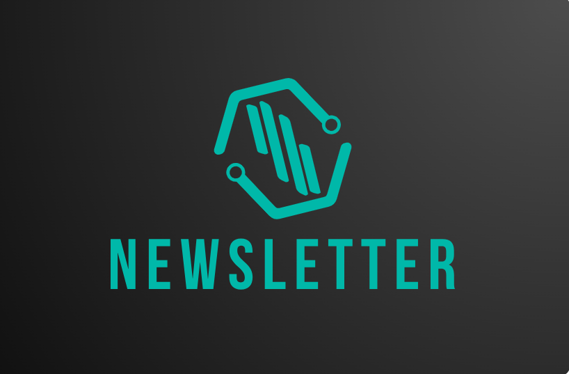
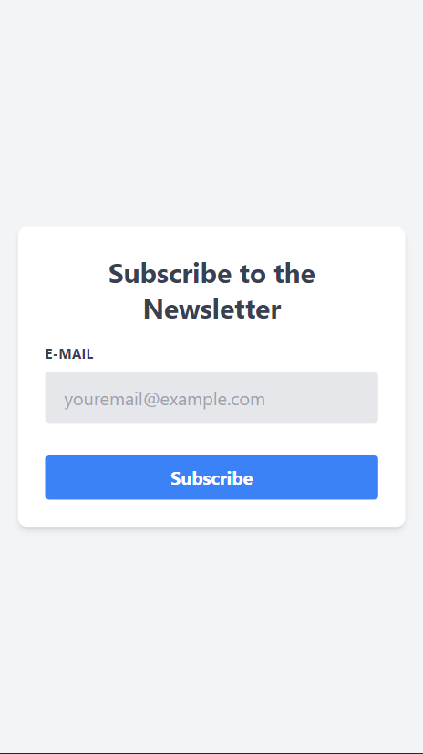
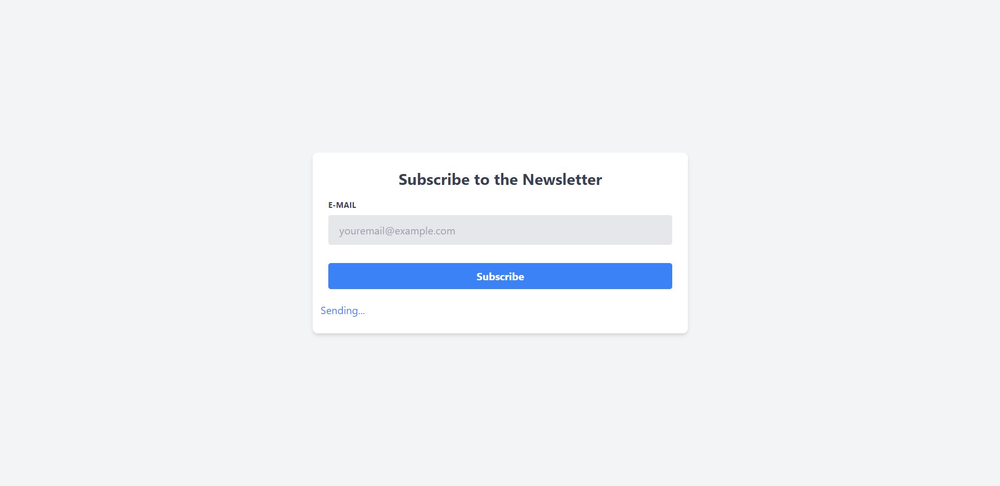
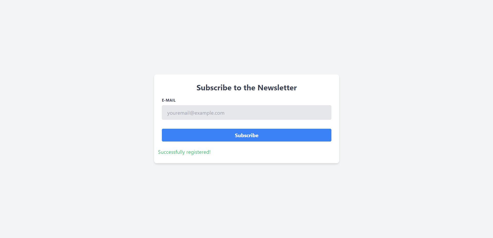
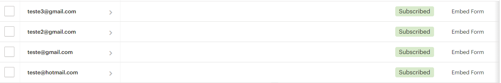

# Newsletter Subscription App

## Overview

This React and TypeScript application allows users to subscribe to a newsletter. It integrates with MailChimp to handle email subscriptions and automate email campaigns.



## Features

- Modern, responsive UI for collecting email addresses.
- Seamless integration with MailChimp for subscriber management.
- Utilization of environment variables for secure configuration.

## Configuration

### MailChimp Setup

To use this application, you need to set up your MailChimp account:

1. Obtain your MailChimp API Key.
2. Create a `.env` file in the root directory of the project.
3. Add your MailChimp API Key to the `.env` file:

   ```env
   VITE_MAILCHIMP_API_KEY=your_mailchimp_api_key
   VITE_MAILCHIMP_LIST_ID=your_mailchimp_list_id
   ```

Ensure these values are kept secret and are not committed to your git repository.

## Screenshots

### Desktop View


### Mobile View



### Loading State



### Success State



### MailChimp Registered Emails



## Usage

After setting up your MailChimp details in the `.env` file, you can run the application in your local development environment.

## Contributing

Contributions to enhance this application are welcome. Please feel free to submit issues and pull requests.

## Acknowledgements

- React community for the comprehensive ecosystem.
- MailChimp for providing the email marketing platform.
